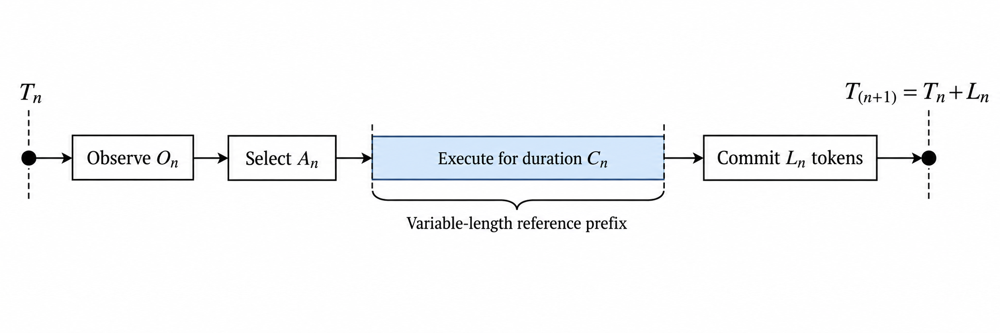

<div align="center">

# MaskSpec

**Deciding, safely, when a language model can skip ahead, guess ahead, or must decode one token at a time**

A compiler-guided systems proposal for structured decoding: it uses what the constraint engine
already knows about the current output to pick the cheapest decoding strategy at every step,
without ever changing what the model is allowed to produce.

[Read the research proposal](research/maskspec-research-proposal-draft.pdf) ·
[Research questions](#research-questions) ·
[Correctness boundary](#what-exact-means) ·
[Evaluation plan](#how-the-proposal-will-be-tested)

</div>

> **Research status:** MaskSpec is a pre-registered systems design. It is not yet implemented or
> experimentally evaluated. The repository currently presents the research problem, formal model,
> proposed algorithms, proof obligations, and falsifiable evaluation plan. It reports no speedup or
> completed-system result.

## The problem

Any system that makes a language model produce valid JSON, code, or another structured format
pays the same tax: at every step, an engine checks which tokens are still legal, and the model
then generates one token at a time regardless of how predictable the next few actually are.

But structured output is not uniformly hard to predict. In a single response, generation moves
through very different terrain:

- stretches that are completely forced (a closing bracket, a fixed key, required punctuation);
- narrow choices among a handful of options (an enum, a short list of valid next words);
- open-ended natural language (a free-text field, an explanation);
- deeply nested or repeated structure (arrays inside objects, objects inside arrays).

Most systems treat all of this the same way. Decoding one token at a time is always safe but
wastes time on the parts that were never in doubt. Guessing several tokens ahead (speculative
decoding) helps when the model is confident, and wastes work when it is not. Jumping straight to
the "obviously correct" bytes is fastest of all, but can be unsafe: the same bytes can often be
split into tokens more than one way, and picking the wrong split silently changes what the model
believes it has already said.

MaskSpec asks a direct question: since the constraint engine already knows which of these
situations it is in, can that knowledge be used to pick the cheapest safe strategy at every
single step, without ever changing the distribution the model is allowed to sample from?

## Core research insight

Constraint state has two different jobs:

| State | Purpose | Failure consequence |
| --- | --- | --- |
| `ResidualDescriptor` | Predict whether an action may be profitable | A slower choice |
| `ExecutionCertificate` | Prove that a transformation is semantically admissible | A possible semantic violation |

This separation creates a clear trust boundary. Predictions never authorize transformations. Every
optimized execution kernel must independently satisfy the reference-law contract, and constrained AR
remains the semantic fallback.

## Proposed execution modes

| Mode | Proposed behavior | Required semantic condition |
| --- | --- | --- |
| `AR` | Sample one token from the locally masked target distribution | Defines the reference process |
| `JUMP(r)` | Batch a certified forced token path of length $r$ | Every certified position has one legal, positive-mass token ID |
| `SPEC(K)` | Propose up to $K$ constrained draft tokens and verify them together | Fresh masks at every tentative prefix, exact acceptance and correction, and exact rollback |

The proposed scheduler chooses only among eligible actions using information available at the current
decision epoch. It must not inspect future proposal acceptance or target-sampling randomness.

## Decision epochs



At epoch $n$, the controller observes $O_n$, selects $A_n$, spends wall time $C_n$, and commits a
random-length reference prefix $L_n$:

$$
T_{n+1}=T_n+L_n.
$$

This is naturally a semi-Markov or renewal-style control problem. A practical first controller is
myopic. It estimates immediate utility; it does not claim globally optimal generation latency.

## What "exact" means

MaskSpec targets equality to a declared **locally masked constrained-AR token law**:

$$
p_{\mathrm{local}}(x\mid h,s)=
\frac{p(x\mid h)\mathbf{1}[x\in\mathcal A_{\mathrm{impl}}(s)]}
{\sum_y p(y\mid h)\mathbf{1}[y\in\mathcal A_{\mathrm{impl}}(s)]}.
$$

Here, $p$ is the target distribution after the declared non-constraint logits processing, temperature,
and truncation pipeline. All execution modes must use the same pipeline and operational legal-token
semantics.

This target is not the same as conditioning the unmasked language model on eventual membership in a
grammar. MaskSpec does not claim to recover that global grammar-conditioned distribution. Valid output
alone is also not evidence of distributional equality.

## Why forced bytes are not enough

If a grammar forces the bytes `ab`, a tokenizer may still admit both:

```text
[token_ab]
[token_a, token_b]
```

The paths emit the same bytes but can have different probabilities and model states. The conservative
JUMP certificate therefore requires a singleton legal token-ID set at every skipped position:

$$
\mathcal A_{\mathrm{impl}}(s_i)=\{\tau_i\}.
$$

The target model must still process the certified tokens so that its history and KV cache reach the
correct state. JUMP may reduce serial iterations, but it does not make target-model advancement free.

## Research questions

1. Under what conditions do constrained `SPEC`, certified `JUMP`, and their adaptive composition
   preserve the local reference token law?
2. Does residual compiler and parser state predict the best action beyond mask density and model-only
   signals after feature-acquisition cost is charged?
3. When do `JUMP(r)` or `SPEC(K)` improve end-to-end latency after target prefill, KV traffic, masking,
   rollback, controller, and synchronization costs are included?

## Proposed architecture

The design separates three feature sources:

- **Static compiler features:** constraint family, schema region, parser-state class, branching,
  recursion, precomputed singleton transitions, and forced-run bounds.
- **Dynamic parser features:** current stack depth, active branches, validator cursors, accepting state,
  retained bytes, and legal-set size.
- **Runtime features:** backend, batch, model pair, recent acceptance, measured mask cost, KV layout,
  and device utilization.

If static compiler features do not add predictive value, the correct empirical description becomes
**constraint-state-guided scheduling**. The proposal treats that as a possible negative result, not a
wording problem.

## How the proposal will be tested

Correctness is a gate for performance reporting. The planned evaluation includes:

- exhaustive tiny-vocabulary and toy-model distribution checks;
- rollback-versus-replay differential tests;
- adversarial aliases, segmentations, UTF-8 fragments, boundary-crossing tokens, EOS, and empty support;
- JSON Schema, regular-expression, grammar, and open-string workloads;
- fixed-action, fixed-depth, mask-density-only, model-only, and myopic-oracle baselines;
- complete accounting for parser, mask, certificate, controller, draft, target, prefill, KV, rollback,
  synchronization, memory, and compilation costs;
- paired trials, held-out schema families, uncertainty intervals, practical-effect thresholds, and raw
  artifact regeneration.

The central performance hypothesis fails if the strongest tuned fixed policy remains faster after all
costs are counted. The certificate hypothesis fails on any reproducible token-law violation. These are
useful scientific outcomes because they identify whether the limiting factor is prediction, coverage,
transaction cost, or target-model advancement.

## Research artifact

The current paper is available as:

- [MaskSpec research proposal draft](research/maskspec-research-proposal-draft.pdf)

The proposal contains the formal reference semantics, AR/JUMP/SPEC algorithms, six proposition-level
arguments and obligations, the cost model, the adaptive-depth analysis, related-work boundaries, and the
pre-registered experimental design.

## Current scope

| Area | Status |
| --- | --- |
| Research problem and semantic target | Specified in the proposal |
| Proposed algorithms | Specified in the proposal |
| Abstract proofs | Proofs or proof sketches under stated assumptions |
| MaskForge integration | Not implemented |
| Correctness testing | Not run for MaskSpec |
| Performance evaluation | Not run |
| Independent reproduction | Not available |

The next research stage is to implement the slow reference state machine and transactional constraint
semantics, discharge the implementation-specific proof obligations, pass the correctness gates, and only
then execute the pre-registered performance study.

Research interests represented by this project include language-model inference systems, speculative decoding, constrained generation, compiler-derived runtime state, probabilistic correctness, and reproducible performance evaluation.
